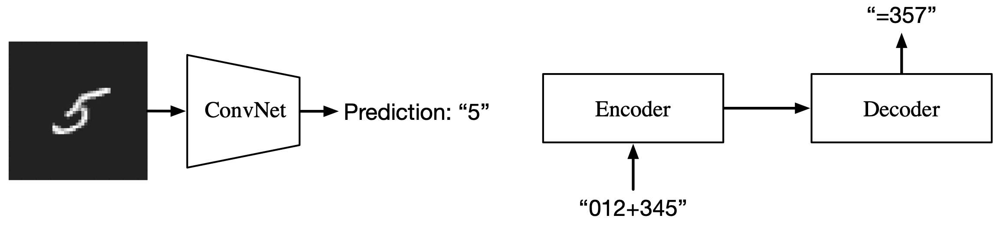
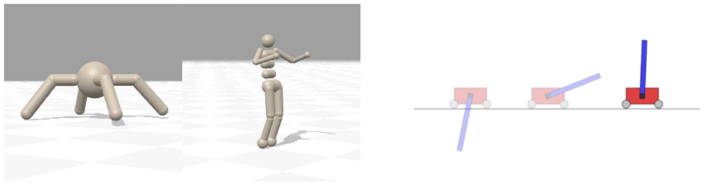

# EvoJAX: Hardware-Accelerated Neuroevolution

EvoJAX is a scalable, general purpose, hardware-accelerated [neuroevolution](https://en.wikipedia.org/wiki/Neuroevolution) toolkit. Built on top of the JAX library, this toolkit enables neuroevolution algorithms to work with neural networks running in parallel across multiple TPU/GPUs. EvoJAX achieves very high performance by implementing the evolution algorithm, neural network and task all in NumPy, which is compiled just-in-time to run on accelerators.

This repo also includes several extensible examples of EvoJAX for a wide range of tasks, including supervised learning, reinforcement learning and generative art, demonstrating how EvoJAX can run your evolution experiments within minutes on a single accelerator, compared to hours or days when using CPUs.

EvoJAX paper: https://arxiv.org/abs/2202.05008

Please use this BibTeX if you wish to cite this project in your publications:

```
@article{evojax2022,
  title={EvoJAX: Hardware-Accelerated Neuroevolution},
  author={Tang, Yujin and Tian, Yingtao and Ha, David},
  journal={arXiv preprint arXiv:2202.05008},
  year={2022}
}
```

List of publications using EvoJAX (please open a PR to add missing entries):

- [Modern Evolution Strategies for Creativity: Fitting Concrete Images and Abstract Concepts](https://es-clip.github.io/) (NeurIPS Creativity Workshop 2021, EvoMUSART 2022)

## Installation

EvoJAX is implemented in [JAX](https://github.com/google/jax) which needs to be installed first.

**Install JAX**: 
Please first follow JAX's [installation instruction](https://github.com/google/jax#installation) with optional GPU/TPU backend support.
In case JAX is not set up, EvoJAX installation will still try pulling a CPU-only version of JAX.
Note that Colab runtimes come with JAX pre-installed.


**Install EvoJAX**:
```shell
# Install from PyPI.
pip install evojax

# Or, install from our GitHub repo.
pip install git+https://github.com/google/evojax.git@main
```

If you also want to install the extra dependencies required for certain optional functionalities, use
```shell
pip install evojax[extra]
# Or
pip install git+https://github.com/google/evojax.git@main#egg=evojax[extra]
```

## Code Overview

EvoJAX is a framework with three major components, which we expect the users to extend.
1. **Neuroevolution Algorithms** All neuroevolution algorithms should implement the `evojax.algo.base.NEAlgorithm` interface and reside in `evojax/algo/`.
See [here](https://github.com/google/evojax/blob/main/evojax/algo/README.md) for the available algorithms in EvoJAX.
2. **Policy Networks** All neural networks should implement the `evojax.policy.base.PolicyNetwork` interface and be saved in `evojax/policy/`.
In this repo, we give example implementations of the MLP, ConvNet, Seq2Seq and [PermutationInvariant](https://attentionneuron.github.io/) models.
3. **Tasks** All tasks should implement `evojax.task.base.VectorizedTask` and be in `evojax/task/`.

These components can be used either independently, or orchestrated by `evojax.trainer` and `evojax.sim_mgr` that manage the training pipeline.
While they should be sufficient for the currently provided policies and tasks, we plan to extend their functionality in the future as the need arises.

## Examples

As a quickstart, we provide non-trivial examples (scripts in `examples/` and notebooks in `examples/notebooks`) to illustrate the usage of EvoJAX.
We provide example commands to start the training process at the top of each script.
These scripts and notebooks are run with TPUs and/or NVIDIA V100 GPU(s):

### Supervised Learning Tasks

*While one would obviously use gradient-descent for such tasks in practice, the point is to show that neuroevolution can also solve them to some degree of accuracy within a short amount of time, which will be useful when these models are adapted within a more complicated task where gradient-based approaches may not work.*

</img>

* [MNIST Classification](https://github.com/google/evojax/blob/main/examples/train_mnist.py) -
We show that EvoJAX trains a ConvNet policy to achieve >98% test accuracy within 5 min on a single GPU.
* [Seq2Seq Learning](https://github.com/google/evojax/blob/main/examples/train_seq2seq.py) -
We demonstrate that EvoJAX is capable of learning a large network with hundreds of thousands parameters to accomplish a seq2seq task.

### Classic Control Tasks

*The purpose of including control tasks are two-fold: 1) Unlike supervised learning tasks, control tasks in EvoJAX have undetermined number of steps, we thus use these examples to demonstrate the efficiency of our task roll-out loops. 2) We wish to show the speed-up benefit of implementing tasks in JAX and illustrate how to implement one from scratch.*

</img>

* [Locomotion](https://github.com/google/evojax/blob/main/examples/notebooks/BraxTasks.ipynb) -
[Brax](https://github.com/google/brax) is a differentiable physics engine implemented in JAX.
We wrap it as a task and train with EvoJAX on GPUs/TPUs. It takes EvoJAX tens of minutes to solve a locomotion task in Brax.
* [Cart-Pole Swing Up](https://github.com/google/evojax/blob/main/examples/train_cartpole.py) -
We illustrate how the classic control task can be implemented in JAX and be integrated into EvoJAX's pipeline for significant speed up training.

### Novel Tasks

*In this last category, we go beyond simple illustrations and show examples of novel tasks that are more practical and attractive to researchers in the genetic and evolutionary computation area, with the goal of helping them try out ideas in EvoJAX.*

<table width="100%">
  <tr>
    <td width="50%">
      </img>
    </td>
    <td width="50%">
      </img>
    </td>
  </tr>
  <tr>
    <td>
      Multi-agent WaterWorld
    </td>
    <td>
      ES-CLIP: <i>“A drawing of a cat”</i>
    </td>
  </tr>
</table>

* [WaterWorld](https://github.com/google/evojax/blob/main/examples/train_waterworld.py) -
In this [task](https://cs.stanford.edu/people/karpathy/reinforcejs/waterworld.html), an agent tries to get as much food as possible while avoiding poisons.
EvoJAX is able to learn the agent in tens of minutes on a single GPU.
Moreover, we demonstrate that [multi-agents training](https://github.com/google/evojax/blob/main/examples/train_waterworld_ma.py) in EvoJAX is possible, which is beneficial for learning policies that can deal with environmental complexity and uncertainties.
* [Abstract Paintings](https://es-clip.github.io/) ([notebook 1](https://github.com/google/evojax/blob/main/examples/notebooks/AbstractPainting01.ipynb) and [notebook 2](https://github.com/google/evojax/blob/main/examples/notebooks/AbstractPainting02.ipynb)) -
We reproduce the results from this [computational creativity work](https://es-clip.github.io/) and show how the original work, whose implementation requires multiple CPUs and GPUs, could be accelerated on a single GPU efficiently using EvoJAX, which was not possible before.
Moreover, with multiple GPUs/TPUs, EvoJAX can further speed up the mentioned work almost linearly.
We also show that the modular design of EvoJAX allows its components to be used independently -- in this case it is possible to use only the ES algorithms from EvoJAX while leveraging one's own training loops and environment implantation.

## Call for Contributions

The goal of EvoJAX is to get evolutionary computation to able to work on a vast array of tasks using accelerators.

One issue before was that many evolution algorithms were only optimized for one particular task for some paper. This is the reason we focused only on one single algorithm (PGPE) in the first release of EvoJAX, while creating 6+ different tasks in diverse domains, ensuring that one single algorithm works for all of the tasks without any issues. See [Table](https://github.com/google/evojax/blob/main/evojax/algo/README.md) of contributed algorithms.

### Evolutionary Algorithms

We welcome new evolution algorithms to be added to this toolkit. It would be great if you can show that your implementation can perform on cart-pole swing-up (hardmode), BRAX, waterworld, and MNIST, before submitting a pull request.

Ideas for evolutionary algorithm candidates:

- Your favorite Genetic Algorithm.
- [CMA-ES](https://en.wikipedia.org/wiki/CMA-ES) (bare version, and improved versions such as [BIPOP-CMA-ES](https://hal.inria.fr/hal-00818596v1/document))
- Augmented Random Search ([paper](https://arxiv.org/abs/1803.07055))
- AMaLGaM-IDEA ([paper](https://homepages.cwi.nl/~bosman/publications/2013_benchmarkingparameterfree.pdf))

We suggest the below performance guidelines for new algorithms:

1. MNIST: 90%+
2. Cartpole: 900+ (easy), 600+ (hard)
3. Waterworld: 6+ (single-agent), 2+ (multiiagent)
4. Brax ant: 3000+

Note that these are not hard requirements, but just rough guidelines.

Please use the [benchmark script](https://github.com/google/evojax/tree/main/scripts/benchmarks) to evaluate your algorithm before sending us a PR, let us know if you are unable to test on some tasks due to hardware limitations.
See this [example](https://github.com/google/evojax/pull/5#issuecomment-1043879609) pull request thread of a Genetic Algorithm that has been merged into EvoJAX to see how it should be done. 

Feel free to reach out to evojax-dev@google.com if you wish to discuss further.

### New Tasks

We also welcome new tasks and examples. Some suggestions:

- Train a [Neural Turing Machine](https://en.wikipedia.org/wiki/Neural_Turing_machine) using evolution to come up with a sorting algorithm.
- Soccer via self-play ([Example](https://mobile.aau.at/~welmenre/papers/fehervari-2010-Evolving_Neural_Network_Controllers_for_a_Team_of_Self-organizing_Robots.pdf))
- Evolving Hebbian Learning-capable plastic networks that can remember the map of a maze from the agent’s recent experience.
- [Adaptive Computation Time for RNNs](https://arxiv.org/abs/1603.08983) performing a task that requires an unknown number of steps.
- Tasks that make use of hard attention.

## Sister Projects

There is a growing number of researchers working with evolutionary computation who are using JAX. Here is a list of related efforts:

- QDax: Accelerated Quality-Diversity. A tool that uses JAX to help accelerate Quality-Diveristy (QD) algorithms through hardware accelerators and massive parallelism. ([GitHub](https://github.com/adaptive-intelligent-robotics/QDax) | [paper](https://arxiv.org/abs/2202.01258))

- evosax: A JAX-based library of evolution strategies focusing on JAX-composable ask-tell functionality and strategy diversity. More than 10 ES algorithms implemented. ([GitHub](https://github.com/RobertTLange/evosax))

## Disclaimer
This is not an official Google product.
